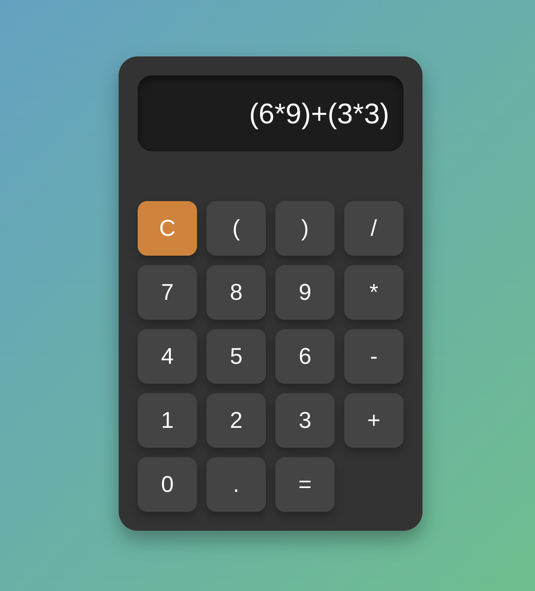

# Web 

 ## How did it go ?

 - To be honest i've was feeling like doing sorcery (it was month ago, when i stated to learn JS).

 - I was stacking divs, properties, and so on. Of course I was like every beginner (I remain in the beginning, but I relearned how to learn properly).

 - I have to admit that I had a lot of trouble getting my calculator to work. I obviously took help from the numerous documentation available, from YouTube which is full of similar learning projects. And obviously, ChatGPT.

 - I have to admit that I had a lot of trouble getting my calculator to work. I obviously took help from the numerous documentation available, from YouTube which is full of similar learning projects. And obviously, ChatGPT.

 - That's when I understood the power of this assistant. But also the danger of excessive use of AI.

 - We must not lose sight of learning and practice that we could call classic. Because I don't teach anyone anything: it's by doing that we succeed.
 <br>
 


## Description  
This project is a responsive web calculator built using HTML, CSS, and JavaScript. It allows users to perform arithmetic operations with an intuitive and modern interface.

## Features  

- **Mathematical Expression Evaluation**: Supports basic operations (+, -, *, /) and parentheses.  
- **Implicit Multiplication Handling**: Automatically interprets missing multiplication symbols (e.g., `2(3)` is treated as `2*3`).  
- **Error Handling**: Displays an error message for invalid inputs.  
- **Modern Design**: Sleek and responsive interface with smooth transitions and shadows.

## Technologies Used  
- **HTML**: Defines the structure of the calculator.  
- **CSS**: Styles the interface with grid and flexbox layouts.  
- **JavaScript**: Handles user interactions and evaluates mathematical expressions.  
- **Library `math.js`**: Included for potential future improvements in handling complex calculations.

## Screenshots  


## Potential Improvements  
- A simple back button that I realize I forgot as I type these lines.
- Keyboard Support   
- Utilize the `math.js` library for advanced calculations.  
- Add unit tests for edge cases and error handling.  
- Improve responsiveness for small screens (mobile and tablet).

## How to Use  
1. Clone the repository:  
   ```bash
   git clone https://github.com/USERNAME/Calculator.git
   ```
2. Open the `index.html` file in your web browser.


